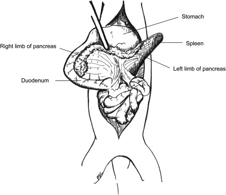
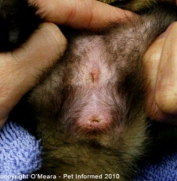

# Ferret Anatomy

1. **Evaluate the coat** -- any thinning? Endocrine alopecia is common in ferrets and can be associated with adrenal disease.

2. **Evaluate the location of the heart in the thoracic cavity** -- the heart is located very caudally compared to other species. This is clinically relevant for radiographic interpretation and cardiac auscultation.

3. **Evaluate the gastrointestinal tract** of this carnivore. A very simple, short GI tract that is typical for a carnivore. The jejunum and ileum are indistinguishable and are coiled together as the jejunoileum. There is a lack of a cecum and appendix. The ileocolic junction is only differentiated by the region where the ileocolic and jejunal arteries join.

4. **Evaluate the location of the adrenal glands, the blood vessels surrounding the adrenals, and their relationship with other organs** -- what is the relevance to common diseases?

   The right adrenal gland lies craniomedial to the right kidney and is closely associated with the caudal vena cava. The left adrenal gland lies ventromedial to the cranial pole of the left kidney. Adrenal disease (adrenocortical neoplasia or hyperplasia) is one of the most common conditions in ferrets. Surgical adrenalectomy, particularly of the right adrenal gland, is challenging due to its intimate association with the vena cava.

*Ferret adrenal glands and their relationship with the kidneys and ureters.*

5. **Gently palpate the pancreas for nodules** -- what is the clinical relevance?

   Insulinoma (pancreatic beta-cell tumor) is one of the most common neoplasms in ferrets. Palpable nodules in the pancreas may indicate insulinoma. The pancreas has two limbs: the right limb lies along the descending duodenum, and the left limb extends toward the spleen and stomach.

*Ferret pancreas showing the right limb, left limb, stomach, spleen, and duodenum.*

6. **Evaluate mesenteric lymph nodes** -- mesenteric lymph nodes are large even in health, especially at the mesenteric root. They can be mistaken for a lesion! Do not confuse normal large lymph nodes with pathology.

7. **Male urogenital anatomy**: Evaluate the bladder, prostate, os penis, and urethral opening. The most common emergency presentation is urinary blockage. Name two etiologies for this (adrenal disease causing prostatic enlargement, and urolithiasis). A tube cystotomy can sometimes be necessary to provide urinary relief.

8. **Female urogenital anatomy**: Evaluate the uterus, ovaries, and vulva. Vulvar swelling can be a sign of adrenal disease or ovarian remnant syndrome in spayed ferrets.

---

## Ferret Viscera

**Left:** Ventral aspect of the viscera of a ferret in situ. **Right:** Anatomy of the viscera and most important blood vessels as seen after removal of the lungs, liver, and gastrointestinal tract.

**Key:**

1. Trachea
2. Left common carotid artery
3. Left subclavian artery
4. Aortic arch
5. Pulmonary trunk
6. Heart
7. Diaphragm
8. Liver
9. Stomach
10. Spleen
11. Left kidney
12. Descending colon
13. Urinary bladder
14. Left testicular vessels
15. Left spermatic cord
16. Left testis
17. Preputial opening
18. Os penis
19. Right testis
20. Prepuce
21. Right spermatic cord
22. Right testicular vessels
23. Jejunoileum
24. Ascending duodenum
25. Cecum (absent)
26. Right kidney
27. Descending duodenum
28. Gallbladder
29. Right lung, middle lobe
30. Right lung, cranial lobe
31. Thymus
32. Right common carotid artery
33. Brachiocephalic trunk
34. Cranial vena cava
35. Right subclavian artery
36. Costocervical trunk
37. Internal thoracic artery
38. Vertebral artery
39. Right common carotid artery (branch)
40. Left vertebral artery
41. Left costocervical trunk
42. Left internal thoracic artery
43. Left subclavian artery (branch)
44. Left common carotid artery (branch)
45. Aortic arch
46. Pulmonary trunk
47. Caudal vena cava
48. Celiac artery
49. Left adrenal gland
50. Cranial mesenteric artery
51. Left renal artery and vein
52. Left testicular artery and vein
53. Caudal mesenteric artery
54. Left deep circumflex iliac artery and vein
55. Left external iliac artery and vein
56. Left internal iliac artery
57. Left umbilical artery
58. Prostate gland
59. Urethra
60. Bulbourethral glands
61. Right deep circumflex iliac artery and vein
62. Right testicular artery and vein
63. Right renal artery and vein
64. Right adrenal gland
65. Hepatic veins

*Adapted from An NQ, Evans HE. Anatomy of the ferret. In: Fox JG, ed. Biology and Diseases of the Ferret. Philadelphia: Lea & Febiger; 1988:14.*
