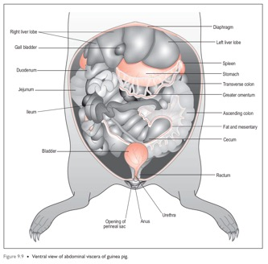
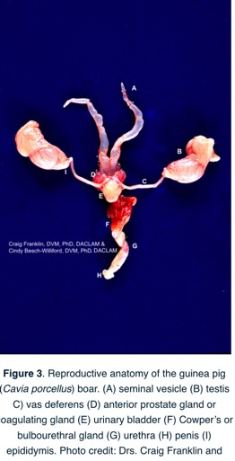
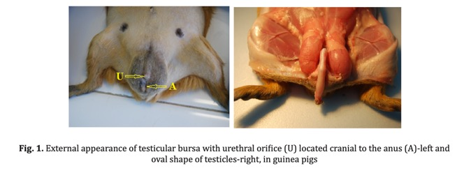
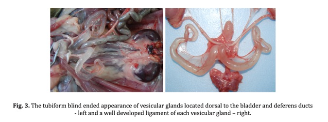
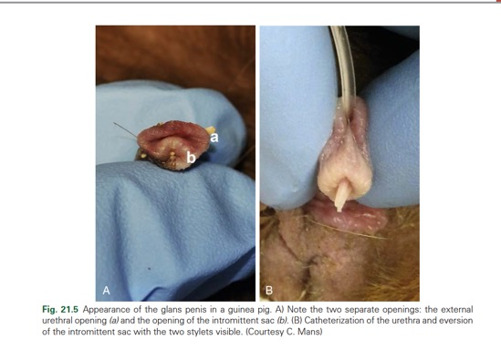
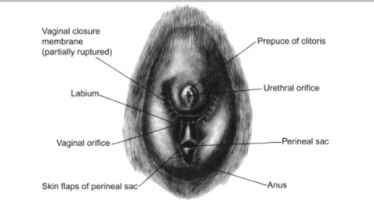
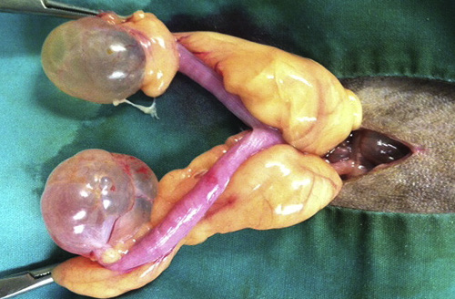
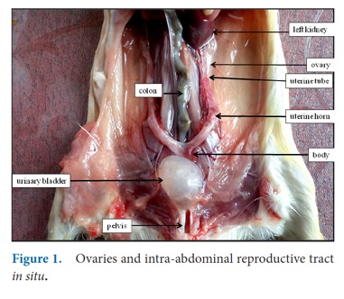

# Guinea Pig Anatomy

## Head Prosection

*3D rendering of the guinea pig head showing the skull and dental anatomy.*

1. **Evaluate the palatal ostium** to identify why it is difficult to intubate these species. The palatal ostium is the narrow opening in the soft palate that connects the oral cavity to the oropharynx -- its small size makes endotracheal intubation extremely challenging.

2. **Observe the thick tongue base and angle of the teeth** compared to the rabbit -- why is this important? The thick tongue base combined with the steep angle of the cheek teeth further limits visualization and access to the oropharynx.

3. **Small nasal cavity** and its relationship to maxillary teeth. The nasal passages are narrow and closely associated with the apices of the maxillary cheek teeth, meaning dental disease can lead to secondary nasal pathology.

4. **Identify location of orbit** and relationship to maxillary teeth. The orbit is closely associated with the apices of the maxillary premolar and molar teeth. Tooth root elongation or abscessation can cause retrobulbar disease and exophthalmos.

---

## Carcass Prosection

1. **Evaluate the small thoracic cavity** and thoracic contents in situ. Guinea pigs have a remarkably small thoracic cavity relative to their abdominal cavity.

2. **Relationship of GI tract to rest of abdomen.** The GI tract, particularly the large cecum, dominates the abdominal cavity.

3. **Evaluate the position and size of the cecum** to consider the additional challenges of an abdominal incision in this species. The cecum occupies a very large portion of the abdomen and must be carefully managed during surgery.

4. **Evaluate the size and thickness of the bladder.** Compare with the rabbit -- the guinea pig bladder wall is thicker.

5. **Evaluate the male coccygeal (grease) gland and the perineal sacs** (also called perianal sacs). The grease gland on the dorsal rump produces oily secretions used for scent marking and can become impacted.

6. **Evaluate the gastrointestinal tract** -- guinea pigs are hindgut fermenters. The stomach is thin-walled and entirely lined with glandular mucosa (no non-glandular region). The cecum is very large, thin-walled, and occupies a significant portion of the abdominal cavity. The cecum has taeniae (longitudinal smooth muscle bands) and haustra (sacculations). The colon also has taeniae.

6. **Evaluate the male reproductive anatomy** -- guinea pigs have several unique features:

   - **Open inguinal rings**: The inguinal canals remain open throughout life. This is important surgically -- the inguinal rings must be closed during castration to prevent herniation of abdominal contents.

   - **External testicular bursa**: A large peritoneal fat pad (epididymal fat pad) is associated with the testicle and lies within the scrotal sac.

   - **Accessory sex glands**: Guinea pigs have large, prominent accessory sex glands including the seminal vesicles (vesicular glands), coagulating glands, prostate, and bulbourethral glands. The vesicular glands are particularly large and conspicuous.

   - **Intromittent sac**: A unique pouch ventral to the os penis that can accumulate debris and secretions. This sac can become impacted, especially in older boars, and requires periodic cleaning.

   - **Os penis**: A small bone is present within the glans penis.

*Figure 3. Guinea pig male reproductive anatomy showing the accessory sex glands and associated structures.*

### Male Reproductive Anatomy Details

*Fig 1. External testicular bursa. Note the large epididymal fat pad associated with the testis within the scrotal sac.*

*Fig 2. Guinea pig testicles and open inguinal rings. The open inguinal canals are clinically significant -- they must be closed during castration to prevent inguinal herniation.*

*Fig 3. Guinea pig vesicular glands (seminal vesicles). These accessory sex glands are remarkably large in the guinea pig and should not be mistaken for pathology.*

7. **Evaluate the glans penis** -- the guinea pig glans penis has two lateral horns (cornua) and a prominent intromittent sac ventral to the os penis. The intromittent sac is a blind pouch that can accumulate keratinized debris, sebaceous secretions, and hair ("boar plug"). This accumulation requires periodic cleaning, especially in older males.

*Illustration of the guinea pig glans penis showing the intromittent sac, os penis, and lateral horns (cornua). The intromittent sac is located ventral to the urethra.*

---

## Female Reproductive Anatomy

8. **Evaluate the female external genitalia** -- the female guinea pig has a Y-shaped vulvar opening with a vaginal closure membrane that seals the vaginal orifice except during estrus and parturition. The urethral papilla is located ventral to the vaginal opening within the vulvar area.

*Illustration of the guinea pig female external genitalia showing the Y-shaped vulvar opening and urethral papilla.*

9. **Evaluate the female gonads and reproductive tract** -- guinea pigs have a short duplex uterus with two separate uterine horns that each open independently into the vaginal canal via their own cervix. The ovaries are located caudal to the kidneys, partially enclosed by the ovarian bursa.

*Figure 1. Guinea pig ovaries and reproductive tract in situ, showing the duplex uterus and ovarian position.*

10. **The urethral opening is extravaginal, like in all rodents.** This is an important anatomical distinction from rabbits and other species.

11. **Evaluate the ovaries for cystic disease** -- ovarian cysts are extremely common in guinea pigs, with prevalence increasing with age. Cysts can be follicular (functional) or serous (rete ovarii cysts). They can become very large and may cause bilateral symmetric alopecia, abdominal distension, and discomfort. Ovariohysterectomy is the definitive treatment, though percutaneous drainage or hormonal therapy (e.g., GnRH agonists) can be used for non-surgical management.

*Guinea pig ovarian cystic disease. Note the markedly enlarged, fluid-filled ovarian cysts. This is one of the most common reproductive disorders in guinea pigs.*

---

*References: Quesenberry KE, Mans C, Orcutt C, Carpenter JW. Ferrets, Rabbits, and Rodents: Clinical Medicine and Surgery. 4th ed. St. Louis: Elsevier; 2021.*
