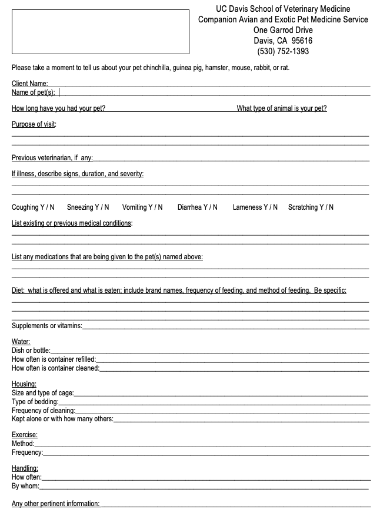

# Appendix B: Small Mammal History Form

> **UC Davis School of Veterinary Medicine**
> Companion Avian and Exotic Pet Medicine Service
> One Garrod Drive, Davis, CA 95616
> (530) 752-1393

*Small Mammal History Form used at UC Davis Companion Avian and Exotic Pet Medicine Service.*
