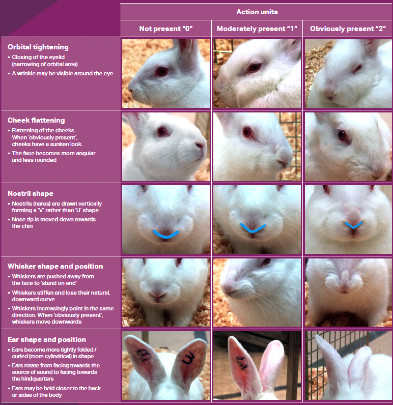
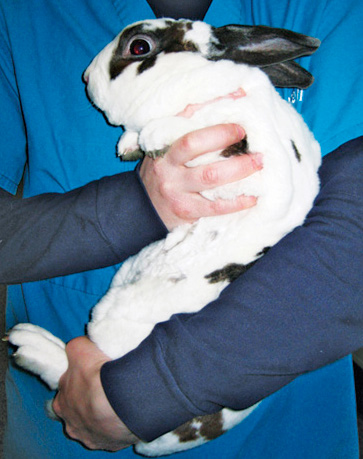
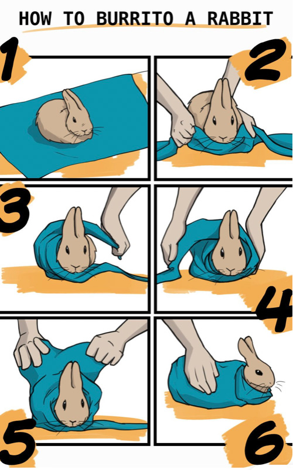
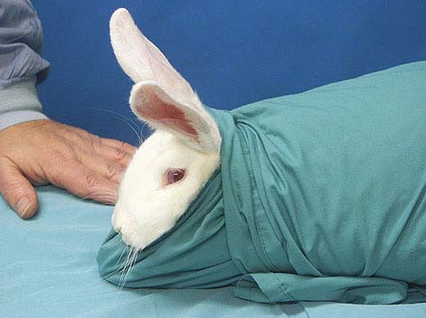

# Handling and Restraint

## Distant Examination

Before handling the rabbit, take a moment to **observe the patient** from a distance. Note the following:

- **Mentation and behavior**: Is the rabbit alert, depressed, or lethargic? Is it interacting with its environment?
- **Posture**: Is the rabbit sitting normally, hunched, or pressing its head into a corner?
- **Respiratory rate and effort**: Count the respiratory rate before handling. Normal respiratory rate is 30-60 breaths per minute. Note any increased effort, open-mouth breathing, or nasal flaring.
- **Body condition**: Does the rabbit appear thin, overweight, or normal?
- **Gait and mobility**: If the rabbit is moving, does it appear coordinated? Is there any lameness?
- **Any discharges**: Observe for nasal discharge, ocular discharge, or soiling around the perineum.

### Rabbit Grimace Scale

The **Rabbit Grimace Scale (RbtGS)** is a validated tool for assessing pain in rabbits. It evaluates five facial action units, each scored from 0 (not present) to 2 (obviously present):

1. **Orbital tightening**: Closing of the eyelid (narrowing of orbital area). A wrinkle may be visible around the eye.
2. **Cheek flattening**: Flattening of the cheeks. When obviously present, cheeks have a sunken look. The face becomes more angular and less rounded.
3. **Nostril shape**: Nostrils (nares) are drawn vertically forming a "V" rather than "U" shape. Nose tip is moved down towards the chin.
4. **Whisker shape and position**: Whiskers are pushed away from the face to stand on end. Whiskers stiffen and lose their natural, downward curve. Whiskers increasingly point in the same direction. When obviously present, whiskers move downwards.
5. **Ear shape and position**: Ears become more tightly folded/curled (more cylindrical) in shape. Ears rotate from facing towards the source of sound to facing towards the hindquarters. Ears may be held closer to the back or sides of the body.

<figure>
  
  <figcaption>The Rabbit Grimace Scale (RbtGS). Five facial action units are each scored from 0 (not present) to 2 (obviously present) to assess pain in rabbits.</figcaption>
</figure>

---

## Safety Warnings

> **IMPORTANT SAFETY PRECAUTIONS**
>
> - **NEVER** pick up a rabbit by its ears. This is painful and can cause injury.
> - **NEVER** place a rabbit on its back (trance/tonic immobility). This is a fear response, not relaxation, and is extremely stressful.
> - **ALWAYS** support the hindquarters. Rabbits have powerful hind legs and a relatively fragile spine. If a rabbit kicks out while unsupported, it can fracture its lumbar spine, resulting in paralysis.
> - Be aware that rabbits can **scratch** with their hind claws and **bite** when frightened.
> - Work on a **non-slip surface** (e.g., a towel on the exam table) to prevent the rabbit from slipping and panicking.
> - Keep the environment **quiet and calm**. Rabbits are prey animals and are easily stressed by loud noises and sudden movements.

---

## Removing from the Cage

- Open the cage door and allow the rabbit to come out on its own if possible.
- If the rabbit must be removed, reach in and place one hand under the thorax and one hand supporting the hindquarters.
- Slide the rabbit towards you and lift it out, keeping it close to your body.
- **Never** pull a rabbit out by the scruff alone or by the ears.
- For top-opening cages, reach in with both hands, scoop the rabbit up from underneath, and lift straight up while supporting the hindquarters.

---

## Football Hold

The football hold is one of the most common and secure ways to carry a rabbit. The rabbit is held firmly against the handler's body, similar to how one would carry a football.

- Tuck the rabbit's head into the crook of your elbow (the antecubital fossa).
- Support the body along your forearm.
- Use your hand to firmly support the hindquarters.
- The rabbit's body should be pressed against your side/torso for security.
- Your other hand can be placed over the rabbit's back for additional stability.
- This hold keeps the rabbit's eyes covered, which has a calming effect.

<figure>
  
  <figcaption>The football hold: the rabbit is tucked against the handler's body with the head in the crook of the elbow and the hindquarters firmly supported.</figcaption>
</figure>

---

## Calming with a Towel

- Placing a towel over the rabbit's eyes can have a calming effect, as it reduces visual stimulation.
- A towel draped over the rabbit on the exam table can help keep the rabbit still during examination.
- The towel also provides a non-slip surface for the rabbit's feet.

---

## Towel Restraint (Burrito Technique)

The towel burrito (also called towel wrap or burrito wrap) is an excellent restraint technique for rabbits that are fractious or for procedures that require the rabbit to remain still (e.g., blood draws, nasolacrimal duct flushes, oral examinations).

**Steps:**

1. Place the rabbit on a large towel on the exam table.
2. Gather the towel snugly around the rabbit's neck, being careful not to restrict breathing.
3. Wrap one side of the towel over the rabbit's body and tuck it under.
4. Wrap the other side over and tuck it under as well.
5. The rabbit should be snugly wrapped with only its head exposed.
6. Individual limbs can be exposed as needed for procedures by creating small openings in the wrap.

<figure>
  
  <figcaption>Step-by-step diagram illustrating how to burrito wrap a rabbit for safe restraint.</figcaption>
</figure>

<figure>
  
  <figcaption>A rabbit restrained using the towel burrito technique, with only the head exposed.</figcaption>
</figure>

---

## Putting the Rabbit Back in the Cage

- **Always place the rabbit hind end first** into the cage or carrier.
- If you place the rabbit head first, it may kick backwards with its powerful hind legs, potentially injuring itself or the handler.
- Support the rabbit securely as you lower it into the cage.
- Place the rabbit gently on the floor of the cage and release your hold only once the rabbit is settled.
- Ensure the cage door is secured after placing the rabbit inside.
