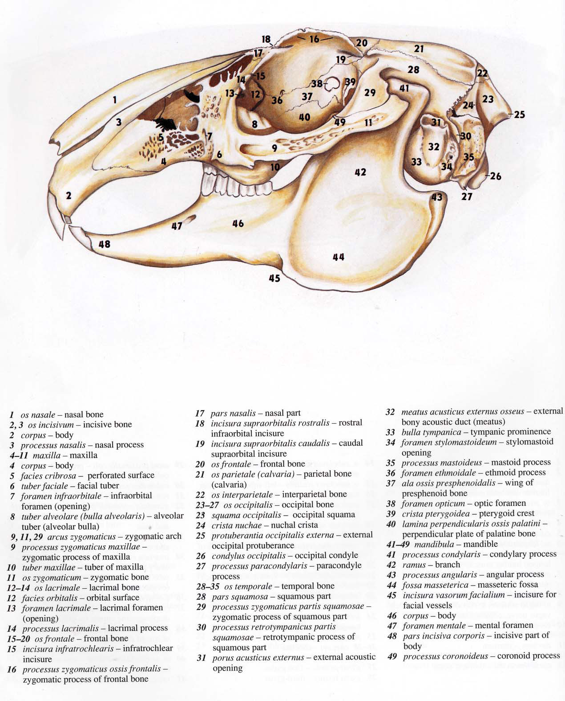
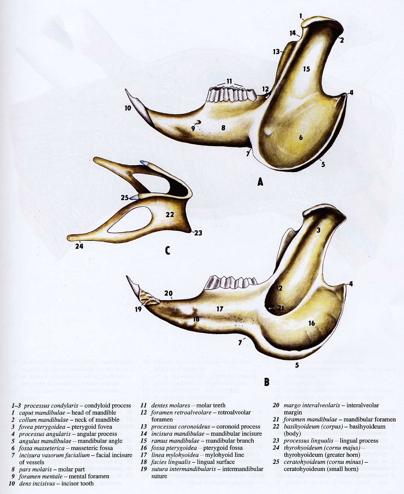
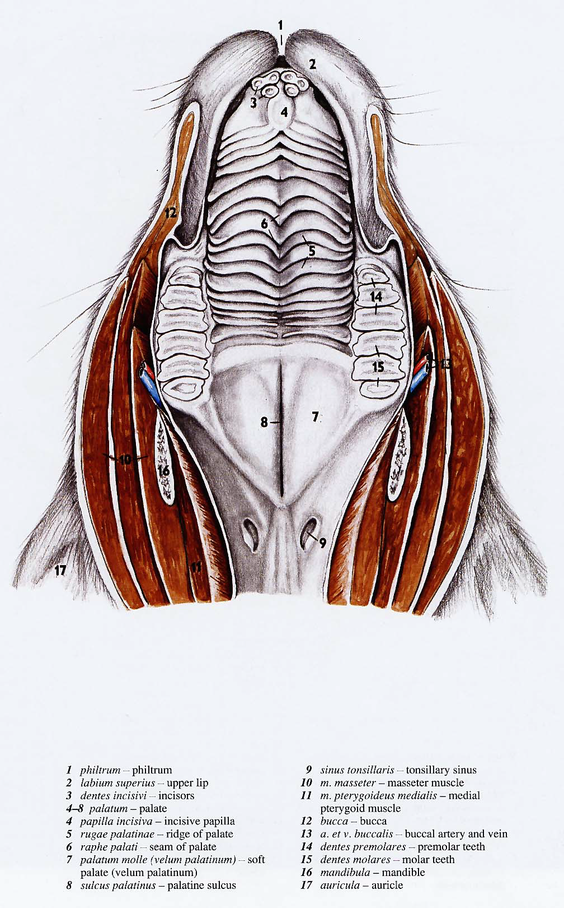
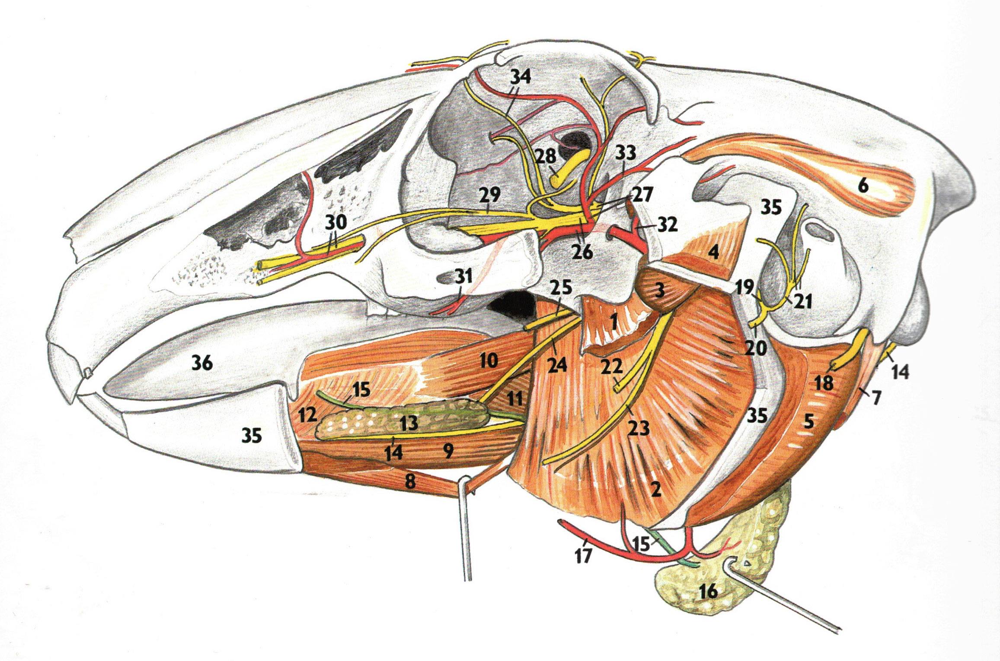
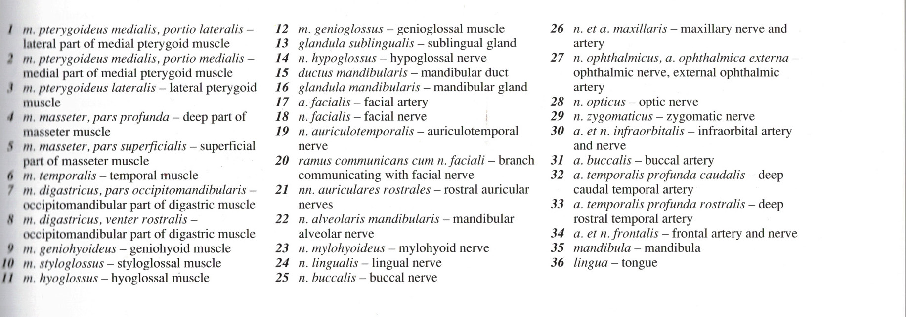
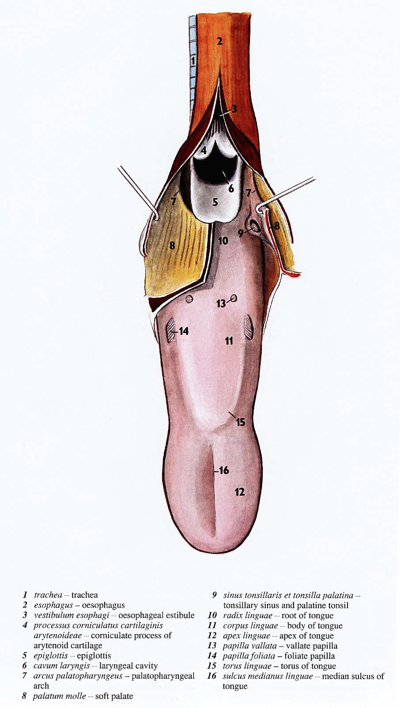
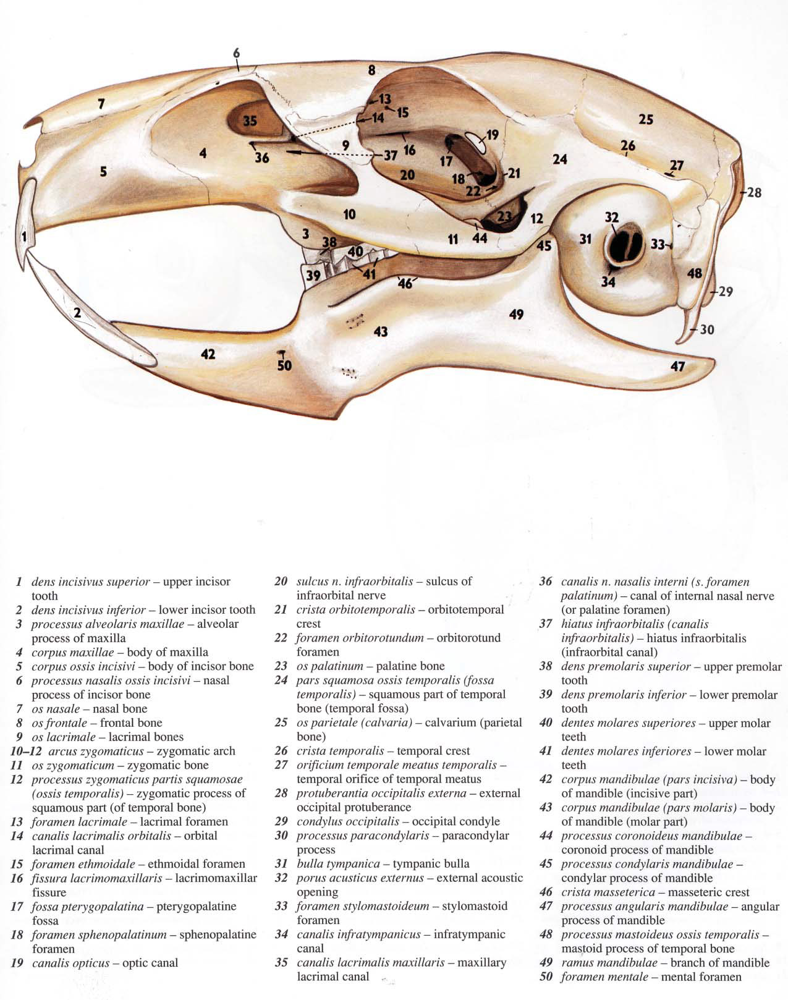
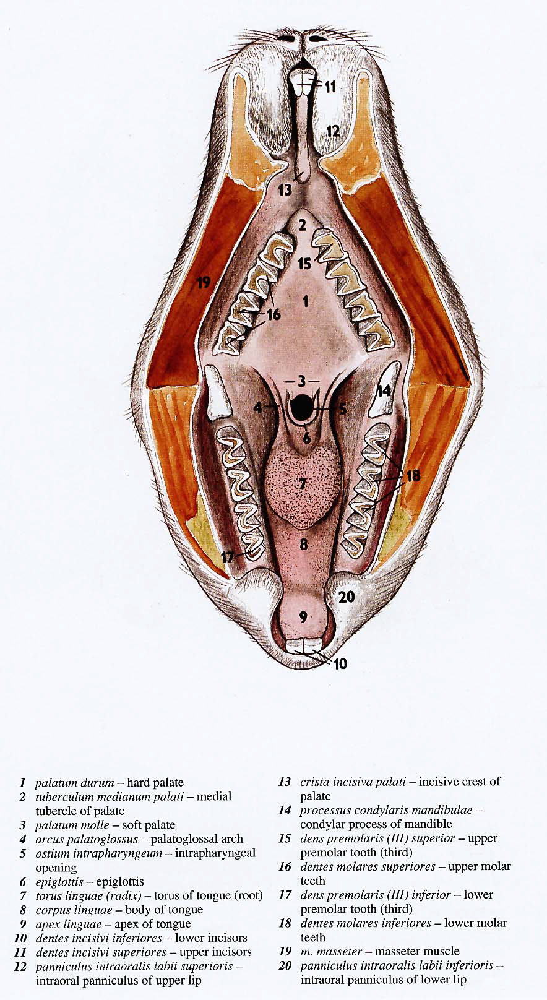

# Appendix A: Anatomical Illustrations

The following anatomical illustrations are from *A Colour Atlas of Anatomy of Small Laboratory Animals*. Popesko P et al, Saunders, 1992.

---

## Rabbit Skull — Lateral View

<figure>

<figcaption>Rabbit skull, lateral view.</figcaption>
</figure>

**Legend:**

1. os nasale — nasal bone
2. os incisivum, corpus — incisive bone, body
3. os incisivum, processus nasalis — incisive bone, nasal process
4. maxilla, corpus — maxilla, body
5. facies cribrosa — perforated surface
6. tuber faciale — facial tuber
7. foramen infraorbitale — infraorbital foramen
8. tuber alveolare (bulla alveolaris) — alveolar tuber
9. processus zygomaticus maxillae — zygomatic process of maxilla
10. tuber maxillae — tuber of maxilla
11. os zygomaticum — zygomatic bone
12. os lacrimale, facies orbitalis — lacrimal bone, orbital surface
13. foramen lacrimale — lacrimal foramen
14. processus lacrimalis — lacrimal process
15. os frontale, incisura infratrochlearis — frontal bone, infratrochlear incisure
16. processus zygomaticus ossis frontalis — zygomatic process of frontal bone
17. os frontale, pars nasalis — frontal bone, nasal part
18. incisura supraorbitalis rostralis — rostral infraorbital incisure
19. incisura supraorbitalis caudalis — caudal supraorbital incisure
20. os frontale — frontal bone
21. os parietale (calvaria) — parietal bone
22. os interparietale — interparietal bone
23. os occipitalis, squama occipitalis — occipital bone, occipital squama
24. crista nuchae — nuchal crista
25. protuberantia occipitalis externa — external occipital protuberance
26. condylus occipitalis — occipital condyle
27. processus paracondylaris — paracondyle process
28. os temporale, pars squamosa — temporal bone, squamous part
29. processus zygomaticus partis squamosae — zygomatic process of squamous part
30. processus retrotympanicus partis squamosae — retrotympanic process of squamous part
31. porus acusticus externus — external acoustic opening
32. meatus acusticus externus osseus — external bony acoustic duct (meatus)
33. bulla tympanica — tympanic prominence
34. foramen stylomastoideum — stylomastoid opening
35. processus mastoideus — mastoid process
36. foramen ethmoidale — ethmoid process
37. ala ossis presphenoidalis — wing of presphenoid bone
38. foramen opticum — optic foramen
39. crista pterygoidea — pterygoid crest
40. lamina perpendicularis ossis palatini — perpendicular plate of palatine bone
41. mandibula, processus condylaris — mandible, condylary process
42. mandibula, ramus — mandible, branch
43. mandibula, processus angularis — mandible, angular process
44. fossa masseterica — masseteric fossa
45. incisura vasorum facialium — incisure for facial vessels
46. mandibula, corpus — mandible, body
47. foramen mentale — mental foramen
48. pars incisiva corporis — incisive part of body
49. processus coronoideus — coronoid process

---

## Rabbit Mandible — Views A, B, C

<figure>

<figcaption>Rabbit mandible: A — lateral view, B — medial view, C — dorsal view, with hyoid apparatus.</figcaption>
</figure>

**Legend:**

1. processus condylaris, caput mandibulae — condyloid process, head of mandible
2. processus condylaris, collum mandibulae — condyloid process, neck of mandible
3. processus condylaris, fovea pterygoidea — condyloid process, pterygoid fovea
4. processus angularis — angular process
5. angulus mandibulae — mandibular angle
6. fossa masseterica — masseteric fossa
7. incisura vasorum facialium — facial incisure of vessels
8. pars molaris — molar part
9. foramen mentale — mental foramen
10. dens incisivus — incisor tooth
11. dentes molares — molar teeth
12. foramen retroalveolare — retroalveolar foramen
13. processus coronoideus — coronoid process
14. incisura mandibulae — mandibular incisure
15. ramus mandibulae — mandibular branch
16. fossa pterygoidea — pterygoid fossa
17. linea mylohyoidea — mylohyoid line
18. facies lingualis — lingual surface
19. sutura intermandibularis — intermandibular suture
20. margo interalveolaris — interalveolar margin
21. foramen mandibulae — mandibular foramen
22. basihyoideum (corpus) — basihyoideum (body)
23. processus lingualis — lingual process
24. thyrohyoideum (cornu majus) — thyrohyoideum (greater horn)
25. ceratohyoideum (cornu minus) — ceratohyoideum (small horn)

---

## Rabbit Oral Cavity — Ventral View

<figure>

<figcaption>Rabbit oral cavity, ventral view.</figcaption>
</figure>

**Legend:**

1. philtrum
2. labium superius — upper lip
3. dentes incisivi — incisors
4. papilla incisiva — incisive papilla
5. rugae palatinae — ridge of palate
6. raphe palati — seam of palate
7. palatum molle (velum palatinum) — soft palate
8. sulcus palatinus — palatine sulcus
9. sinus tonsillaris — tonsillary sinus
10. m. masseter — masseter muscle
11. m. pterygoideus medialis — medial pterygoid muscle
12. bucca — bucca
13. a. et v. buccalis — buccal artery and vein
14. dentes premolares — premolar teeth
15. dentes molares — molar teeth
16. mandibula — mandible
17. auricula — auricle

---

## Rabbit Head — Muscles and Nerves, Lateral View

<figure>

<figcaption>Rabbit head: muscles of mastication, salivary glands, and nerves — lateral view.</figcaption>
</figure>

<figure>

<figcaption>Legend for the rabbit head muscles and nerves illustration.</figcaption>
</figure>

**Legend:**

1. m. pterygoideus medialis, portio lateralis — lateral part of medial pterygoid muscle
2. m. pterygoideus medialis, portio medialis — medial part of medial pterygoid muscle
3. m. pterygoideus lateralis — lateral pterygoid muscle
4. m. masseter, pars profunda — deep part of masseter muscle
5. m. masseter, pars superficialis — superficial part of masseter muscle
6. m. temporalis — temporal muscle
7. m. digastricus, pars occipitomandibularis — occipitomandibular part of digastric muscle
8. m. digastricus, venter rostralis — occipitomandibular part of digastric muscle
9. m. geniohyoideus — geniohyoid muscle
10. m. styloglossus — styloglossus muscle
11. m. hyoglossus — hyoglossal muscle
12. m. genioglossus — genioglossal muscle
13. glandula sublingualis — sublingual gland
14. n. hypoglossus — hypoglossal nerve
15. ductus mandibularis — mandibular duct
16. glandula mandibularis — mandibular gland
17. a. facialis — facial artery
18. n. facialis — facial nerve
19. n. auriculotemporalis — auriculotemporal nerve
20. ramus communicans cum n. faciali — branch communicating with facial nerve
21. nn. auriculares rostrales — rostral auricular nerves
22. n. alveolaris mandibularis — mandibular alveolar nerve
23. n. mylohyoideus — mylohyoid nerve
24. n. lingualis — lingual nerve
25. n. buccalis — buccal nerve
26. n. et a. maxillaris — maxillary nerve and artery
27. n. ophthalmicus, a. ophthalmica externa — ophthalmic nerve, external ophthalmic artery
28. n. opticus — optic nerve
29. n. zygomaticus — zygomatic nerve
30. a. et n. infraorbitalis — infraorbital artery and nerve
31. a. buccalis — buccal artery
32. a. temporalis profunda caudalis — deep caudal temporal artery
33. a. temporalis profunda rostralis — deep rostral temporal artery
34. a. et n. frontalis — frontal artery and nerve
35. mandibula — mandible
36. lingua — tongue

---

## Rabbit Head — Sagittal Section

<figure>

<figcaption>Rabbit head, sagittal section.</figcaption>
</figure>

**Legend:**

1. trachea
2. esophagus
3. vestibulum esophagi — oesophageal vestibule
4. processus corniculatus cartilaginis arytenoideae — corniculate process of arytenoid cartilage
5. epiglottis
6. cavum laryngis — laryngeal cavity
7. arcus palatopharyngeus — palatopharyngeal arch
8. palatum molle — soft palate
9. sinus tonsillaris et tonsilla palatina — tonsillary sinus and palatine tonsil
10. radix linguae — root of tongue
11. corpus linguae — body of tongue
12. apex linguae — apex of tongue
13. papilla vallata — vallate papilla
14. papilla foliata — foliate papilla
15. torus linguae — torus of tongue
16. sulcus medianus linguae — median sulcus of tongue

---

## Guinea Pig Skull — Lateral View

<figure>

<figcaption>Guinea pig skull, lateral view.</figcaption>
</figure>

**Legend:**

1. dens incisivus superior — upper incisor tooth
2. dens incisivus inferior — lower incisor tooth
3. processus alveolaris maxillae — alveolar process of maxilla
4. corpus maxillae — body of maxilla
5. corpus ossis incisivi — body of incisor bone
6. processus nasalis ossis incisivi — nasal process of incisor bone
7. os nasale — nasal bone
8. os frontale — frontal bone
9. os lacrimale — lacrimal bones
10. arcus zygomaticus — zygomatic arch
11. os zygomaticum — zygomatic bone
12. processus zygomaticus partis squamosae (ossis temporalis) — zygomatic process of squamous part (of temporal bone)
13. foramen lacrimale — lacrimal foramen
14. canalis lacrimalis orbitalis — orbital lacrimal canal
15. foramen ethmoidale — ethmoidal foramen
16. fissura lacrimomaxillaris — lacrimomaxillar fissure
17. fossa pterygopalatina — pterygopalatine fossa
18. foramen sphenopalatinum — sphenopalatine foramen
19. canalis opticus — optic canal
20. sulcus n. infraorbitalis — sulcus of infraorbital nerve
21. crista orbitotemporalis — orbitotemporal crest
22. foramen orbitorotundum — orbitorotund foramen
23. os palatinum — palatine bone
24. pars squamosa ossis temporalis (fossa temporalis) — squamous part of temporal bone (temporal fossa)
25. os parietale (calvaria) — calvarium (parietal bone)
26. crista temporalis — temporal crest
27. orificium temporale meatus temporalis — temporal orifice of temporal meatus
28. protuberantia occipitalis externa — external occipital protuberance
29. condylus occipitalis — occipital condyle
30. processus paracondylaris — paracondylar process
31. bulla tympanica — tympanic bulla
32. porus acusticus externus — external acoustic opening
33. foramen stylomastoideum — stylomastoid foramen
34. canalis infratympanicus — infratympanic canal
35. canalis lacrimalis maxillaris — maxillary lacrimal canal
36. canalis n. nasalis interni (s. foramen palatinum) — canal of internal nasal nerve (or palatine foramen)
37. hiatus infraorbitalis (canalis infraorbitalis) — hiatus infraorbitalis (infraorbital canal)
38. dens premolaris superior — upper premolar tooth
39. dens premolaris inferior — lower premolar tooth
40. dentes molares superiores — upper molar teeth
41. dentes molares inferiores — lower molar teeth
42. corpus mandibulae (pars incisiva) — body of mandible (incisive part)
43. corpus mandibulae (pars molaris) — body of mandible (molar part)
44. processus coronoideus mandibulae — coronoid process of mandible
45. processus condylaris mandibulae — condylar process of mandible
46. crista masseterica — masseteric crest
47. processus angularis mandibulae — angular process of mandible
48. processus mastoideus ossis temporalis — mastoid process of temporal bone
49. ramus mandibulae — branch of mandible
50. foramen mentale — mental foramen

---

## Guinea Pig Oral Cavity — Ventral View

<figure>

<figcaption>Guinea pig oral cavity, ventral view.</figcaption>
</figure>

**Legend:**

1. palatum durum — hard palate
2. tuberculum medianum palati — medial tubercle of palate
3. palatum molle — soft palate
4. arcus palatoglossus — palatoglossal arch
5. ostium intrapharyngeum — intrapharyngeal opening
6. epiglottis
7. torus linguae (radix) — torus of tongue (root)
8. corpus linguae — body of tongue
9. apex linguae — apex of tongue
10. dentes incisivi inferiores — lower incisors
11. dentes incisivi superiores — upper incisors
12. panniculus intraoralis labii superioris — intraoral panniculus of upper lip
13. crista incisiva palati — incisive crest of palate
14. processus condylaris mandibulae — condylar process of mandible
15. dens premolaris (III) superior — upper premolar tooth (third)
16. dentes molares superiores — upper molar teeth
17. dens premolaris (III) inferior — lower premolar tooth (third)
18. dentes molares inferiores — lower molar teeth
19. m. masseter — masseter muscle
20. panniculus intraoralis labii inferioris — intraoral panniculus of lower lip
