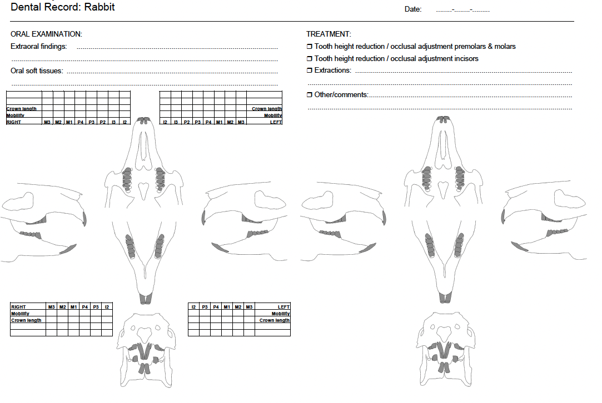
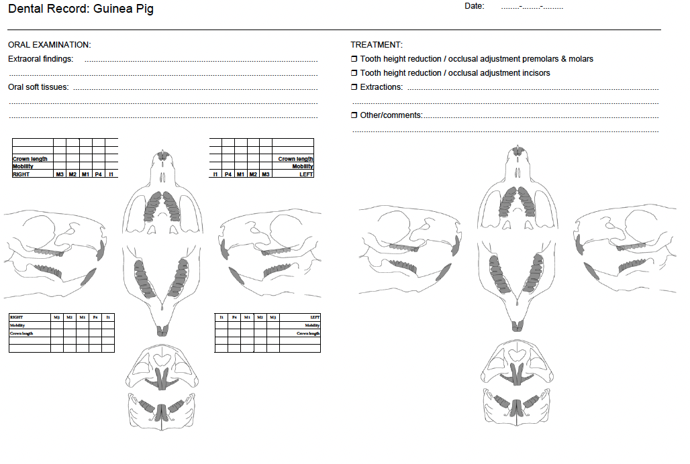

# Appendix B: Dental Charts

Use the following dental record charts to document your oral examination findings, including crown length, mobility, and treatment performed.

---

## Rabbit Dental Record

<figure>

<figcaption>Dental Record: Rabbit — Chart for recording oral examination findings, crown length, mobility, and treatment.</figcaption>
</figure>

---

## Guinea Pig Dental Record

<figure>

<figcaption>Dental Record: Guinea Pig — Chart for recording oral examination findings, crown length, mobility, and treatment.</figcaption>
</figure>
