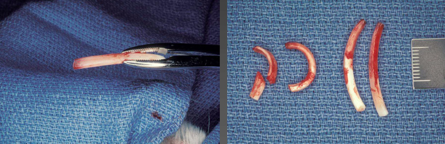
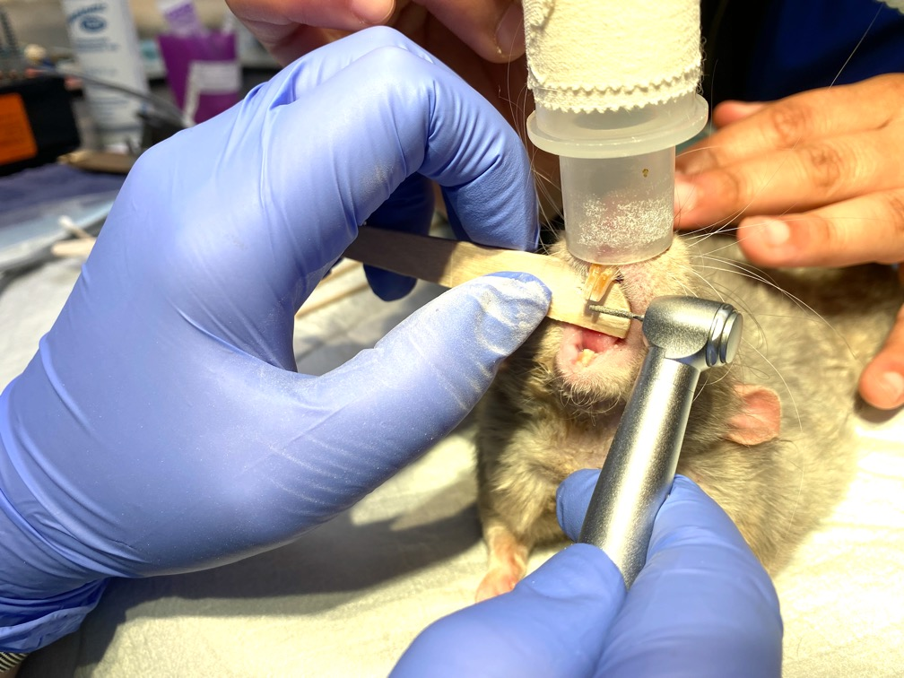

# Extraction of Incisors

## Instruments

- Swann-Morton scalpel handle with straight surgical blade
- Crossley rabbit incisor luxator
- Cryer extraction forceps

## Procedure: Mandibular Incisor Extraction

1. Using the scalpel blade, incise the gingival attachment around the incisor to be extracted. Sever the periodontal ligament circumferentially.
2. Insert the **Crossley rabbit incisor luxator** into the periodontal ligament space along the mesial surface of the tooth.
3. Advance the luxator in the **apical direction**, following the curvature of the tooth.
4. Work the luxator in an **alternating mesial and distal** fashion, progressively loosening the tooth in its alveolus.
5. Be cautious not to apply excessive lateral force that could cause **bone expansion** or fracture of the alveolar bone.
6. **Do not use the luxator as a lever** — the instrument should be used to sever the periodontal ligament, not to pry the tooth from the alveolus.

## Use of Extraction Forceps

Once the tooth is sufficiently mobile:

1. Grasp the tooth gently with the **Cryer extraction forceps**.
2. **Intrude gently** — apply slight inward (apical) pressure to further break down remaining periodontal ligament fibers.
3. **Slide the tooth out** of the curved alveolus, following the natural curvature of the tooth. Apply slight **longitudinal traction** along the axis of the tooth.
4. **Avoid leverage, torque, or premature traction** — the tooth is long and curved, and premature or forceful extraction can fracture the tooth, leaving the apex behind.

## Check for Germinal Tissue

After extraction, inspect the apex of the tooth for the presence of **germinal tissue** (the soft tissue cap at the apex). If present, this confirms complete extraction and ensures the tooth will not regrow.

## Repeat for Maxillary Incisor

Repeat the extraction procedure for the maxillary incisor (I1). Note that the maxillary incisors have a different curvature than the mandibular incisors — the maxillary incisors curve in approximately 180 degrees, whereas the mandibular incisors have a more gentle curve.

<figure>

<figcaption>Steps of the incisor extraction procedure showing luxator insertion and tooth mobilization.</figcaption>
</figure>

<figure>

<figcaption>Extraction instruments and extracted incisors. Note the germinal tissue at the apex of the extracted teeth.</figcaption>
</figure>

<figure>

<figcaption>Cryer extraction forceps used for incisor extraction in rabbits.</figcaption>
</figure>
