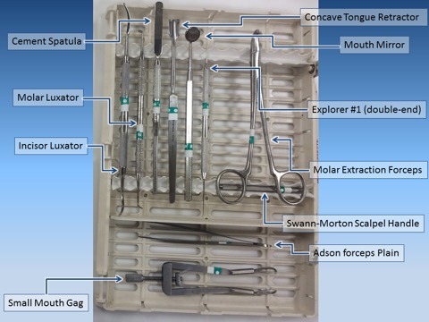
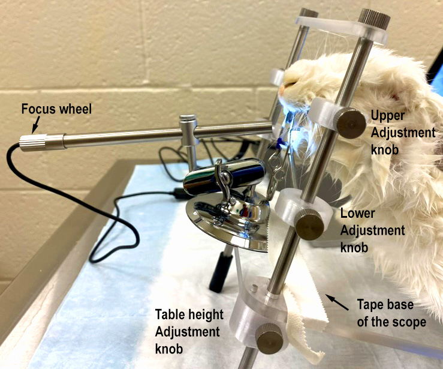
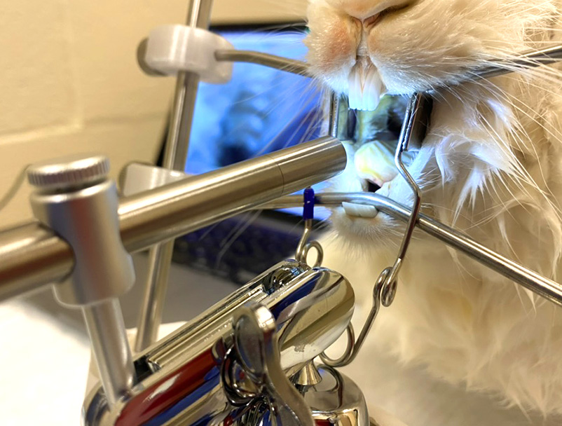
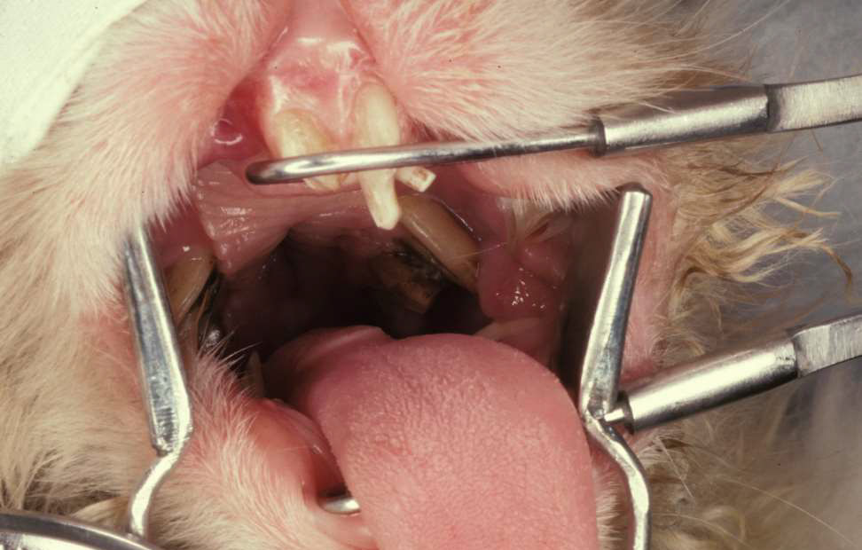
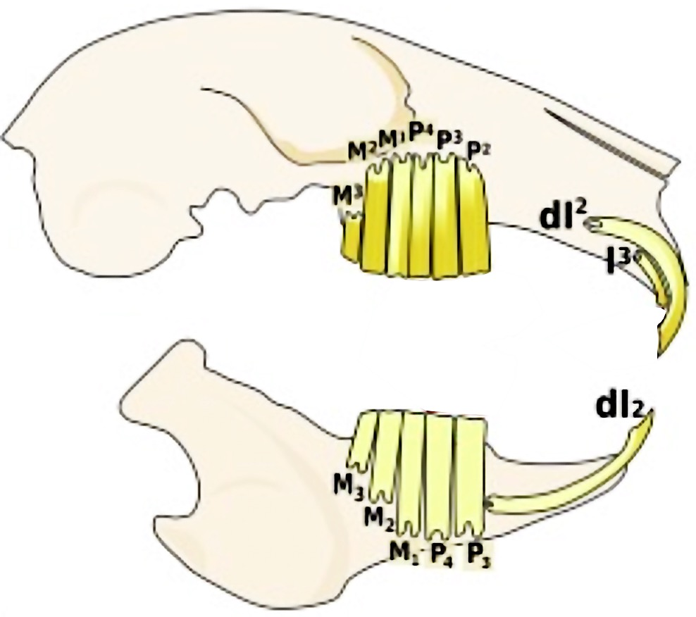
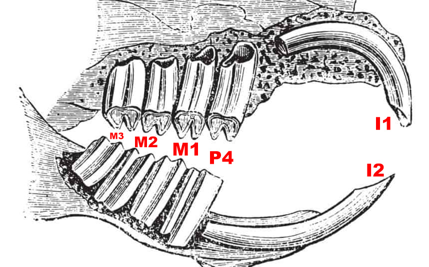

# Clinical Anatomy and Oral Examination

## Extraoral Examination

Perform a systematic extraoral examination of the head in the rabbit and guinea pig. Identify the following structures by palpation and visual inspection:

### Maxillofacial Palpation

- **Mandibular glands** (paired) — palpate ventral to the mandible.
- **Sublingual glands** — located rostral to the mandibular glands.
- **Mandibular lymph node** — located caudoventral to the mandibular gland.
- **Zygomatic arch** — palpate the lateral aspect of the skull.
- **Maxilla** — palpate the lateral and ventral aspects.
- **Facies cribrosa** (rabbit) — the perforated surface of the maxilla, lateral to the nasal bone; unique to rabbits.
- **Infraorbital foramen** (rabbit) — located rostral to the orbit on the maxilla.
- **Hiatus infraorbitalis** (guinea pig) — equivalent region in guinea pigs; corresponds to an open infraorbital canal.
- **Orbit** — palpate the bony rim.
- **Mandible** — palpate the ventral border and lateral body.
- **Incisure for facial vessels** (rabbit) — a palpable notch on the ventral border of the mandible.
- **Angular process** — the caudoventral projection of the mandible.

### Temporomandibular Joint

Palpate the temporomandibular joint (TMJ) while opening and closing the mouth. Evaluate range of motion and symmetry.

### Occlusion

Evaluate the following:

- **Incisor occlusion** — assess alignment, length, and chisel shape of the incisors.
- **Premolar/molar occlusion** — assess the occlusal plane of the cheek teeth.
- **Masticatory movement** — observe the rostrocaudal (rabbit) or laterolateral (guinea pig) jaw excursion.

### Lips and Cheeks

Identify the following:

- **Mucocutaneous junction** — the border between haired skin and oral mucosa.
- **Vestibule** — the space between the lips/cheeks and the dental arcade.
- **Philtrum** — the median cleft of the upper lip.

---

## Oral Examination

### Instruments

Familiarize yourself with the instruments used for the oral examination:

- Cheek dilator (pouch dilator/tabletop retractor)
- Dental table (tabletop oral speculum)
- Small rigid endoscope (2.7 mm, 30 degree)

<figure>

<figcaption>Dental instruments: cheek dilator, dental table, and endoscope used for oral examination of rabbits and rodents.</figcaption>
</figure>

### Positioning the Animal

Place the animal in sternal recumbency. Position the head with the dental table to open the mouth and retract the cheeks with the pouch dilator. Insert the endoscope to visualize the oral cavity.

<figure>

<figcaption>Close-up view of the dental table setup for oral examination.</figcaption>
</figure>

<figure>

<figcaption>Dental table and endoscope positioned for intraoral examination.</figcaption>
</figure>

### Structures to Identify in the Oral Cavity

#### Oral Mucous Membrane

- **Oral mucous membrane** — the lining of the oral cavity.
- **Alveolar mucosa** — the loosely attached mucosa covering the alveolar bone.
- **Mucogingival junction** — the boundary between alveolar mucosa and attached gingiva.
- **Attached gingiva** — the keratinized tissue firmly bound to the underlying periosteum.

#### Floor of the Mouth and Tongue

- **Lingual frenulum** — the mucosal fold connecting the tongue to the floor of the mouth.
- **Torus of the tongue** — the prominent dorsal elevation of the caudal tongue.
- **Intraoral panniculus of the lower lip** (guinea pig) — a mucosal fold on the inner surface of the lower lip unique to guinea pigs.

#### Hard Palate

- **Incisive papilla** — the small elevation on the midline of the hard palate, just caudal to the incisors.
- **Palatine raphe** — the midline ridge of the hard palate.
- **Palatine rugae** — the transverse ridges of the hard palate.
- **Oropharynx** — the caudal portion of the oral cavity leading to the pharynx.
- **Soft palate** — the caudal continuation of the hard palate; note it extends ventral to the tongue in rabbits creating a narrow oropharyngeal isthmus.
- **Palatine sulcus** — the groove along the lateral margin of the hard palate adjacent to the cheek teeth.
- **Palatine tonsils** — lymphoid tissue located in the tonsillary sinus.

### Identify the Teeth

Identify all teeth present and note the dental formula for each species:

**Rabbit:**

| | Maxilla | Mandible |
|---|---|---|
| Deciduous | dI2 | dI2 |
| Permanent | I&#x00B9; - I&#x00B3; (peg tooth) - P&#x00B2; - P&#x00B3; - P&#x2074; - M&#x00B9; - M&#x00B2; - M&#x00B3; | I&#x2081; - P&#x2083; - P&#x2084; - M&#x2081; - M&#x2082; - M&#x2083; |

Dental formula: 2(I 2/1, C 0/0, P 3/2, M 3/3) = 28

**Guinea pig:**

| | Maxilla | Mandible |
|---|---|---|
| Permanent | I&#x00B9; - P&#x2074; - M&#x00B9; - M&#x00B2; - M&#x00B3; | I&#x2081; - P&#x2084; - M&#x2081; - M&#x2082; - M&#x2083; |

Dental formula: 2(I 1/1, C 0/0, P 1/1, M 3/3) = 20

<figure>

<figcaption>Endoscopic view of the rabbit oral cavity showing the cheek teeth.</figcaption>
</figure>

<figure>

<figcaption>Diagram of the rabbit skull showing tooth positions and dental nomenclature.</figcaption>
</figure>

### Structure and Occlusion

**Incisor teeth:**
All teeth in rabbits and rodents are **aradicular hypsodont** (elodont) — they are continuously growing (open-rooted) with no true anatomical root. The incisors have enamel only on the labial (outer) surface. The softer dentin on the lingual (inner) surface wears faster, creating the characteristic chisel shape. In rabbits, the maxillary incisors (I1) have a longitudinal groove on the labial surface. The small peg teeth (I3) sit directly palatal to the main upper incisors. The mandibular incisors are longer than the maxillary incisors and occlude between the peg teeth and the main upper incisors.

**Premolar and molar teeth (cheek teeth):**
The cheek teeth are also aradicular hypsodont. They have a **lophodont** occlusal surface pattern with transverse enamel ridges. In rabbits, the maxillary cheek teeth have a slight buccal curvature, and the mandibular cheek teeth have a slight lingual curvature. The normal occlusal plane is flat, with mandibular cheek teeth slightly narrower than the maxillary arcade. Enamel folds create cutting ridges on the occlusal surface for efficient grinding of fibrous plant material.

### Chart One Quadrant

Using the dental chart provided in Appendix B, chart one quadrant of the oral cavity for your specimen. Record the crown length, presence of spurs, mobility, and any abnormalities noted.

### Comparative Odontology

Compare the dental anatomy of the rabbit with that of the guinea pig. Note the differences in dental formula, skull shape, and dental structure.

<figure>

<figcaption>Guinea pig skull specimen showing the dental arcade and tooth morphology. Note the differences from the rabbit.</figcaption>
</figure>
